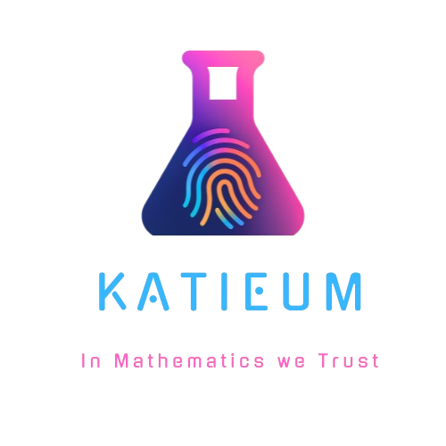
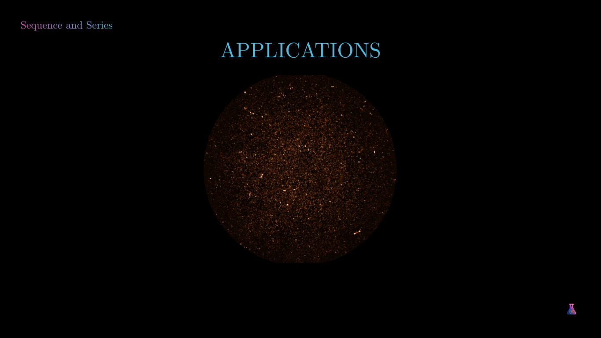

# WELCOME TO
 

# INTRODUCTION
Katieum is a platform that uses interactive visualisations to teach Mathematics & Physical to Sciences National Senior Certificate(NSC) learners, including those rewriting.
I use the [manim](https://github.com/3b1b/manim) engine to create these videos, inspired by the famous & well-celebrated YouTube channel [3Blue1Brown](https://www.youtube.com/@3blue1brown).
This project intents to cover the _National Curriculum and Assessment Policy Statemen(NCAPS)_ of South Africa.

Research has shown that when learners learn abstract STEM consepts through visualisations, they tend to understand the content better. The teaching of Mathematics & Science subjects in South African secondary schools is often abstract, assuming the learner already has mathematical or scientific intuition. The intuition that is required is often not built or given to learners, giving them less time to develop it as they catch up with their work. There seems to be a consistent trend with the performance of Mathematics & Physical Sciences at the NSC level. The [diagnostic report](https://www.education.gov.za/Portals/0/Documents/Reports/2024/2024%20NSC%20Diagnostics%20Book%201.pdf?ver=2025-02-07-130329-033) of the previous year states that learners might be struggling with understanding concepts. And my approach seeks to address this.

# WHY THIS APPROACH?
At the center of delivering content, is **visualisation**. My approach also follows the style of university textbooks, aimed at including the **history**, **motivation** and **application** of concepts.
## 1 HISTORY
The approach will include prominent figures that contributed to these fields or concepts. Figures like Isaac Newton, Albert Einstein & Nikola Tesla have inspired many to become science-nerds.
- This might inspire learner to learn about these individuals, which in turn might pursuade them to love the subject or make them want to become academics.

## 2 MOTIVATION 
This includes motivation of why the concept is important. This will give real-world applications of when & how these concepts are used(e.g Sequence & Series is used by Physicists to classify a star as a White, Blue or Red star. Functions are often used by Structural Engineers to build rigid strong structures to support buildings).
- Keeps learners motivated to know these things as they might be in use in their preferred profession that they want to study.

## 3 APPLICATION 
The provided examples will use real-world applications on known things(e.g we use probability to make sure an individual is HIV positive. A person can test HIV+ while they're negative in actual fact).
- These build on the failures of society & imprints the importance of knowing that particular concept_.

# GOALS
There are a number of goals I wish to achieve with this initiative, most are based from my experience as a learner/student and when I used to help peers and those younger understand abstract Math or Physics concepts. The initiative hopes to achieve :
- to convince learners that Science(especially Mathematics) isn't scary/ugly, but doable & beautiful.
- Provide motivation(real-world applications of the topic/subject discussed).
- Treat ALL learners as beginners to support those with poor performance(including Level 1), providing indepth explainations in Layman's.
- Incorporate advanced university topics(in Layman's & for interest's sake) to help disadvantaged learners choose quantitative fields in higher education.
- and lastly, hoping to teach learners how to be curious and independent in fosturing their own ideas.

# STRUCTURE
Since I am the only one working on the project(_I'd appreciate and LOVE collaboration_), I will initially work on completing Mathematics lessons then later do Physical Sciences. If you wish to collab and do a different subject, you're more than welcome too. I often create the **Material(pdf)** then **Video** in preparing these lessons. Since most topics require the knowledge of other, I intend to cover the topics in the structure below :

which only assumes the knowledge of the previous topic.

The videos will have a voice-over and will be made free to the public. See a demo below.
### Click to see Demo on YouTube :

or Visit [TikTok Account](https://tiktok.com/@Visuals.Katieum)

## License
This project is licensed under the [MIT License](LICENSE). 
#### Wish me luck! Fingers crossed🤞🏽

