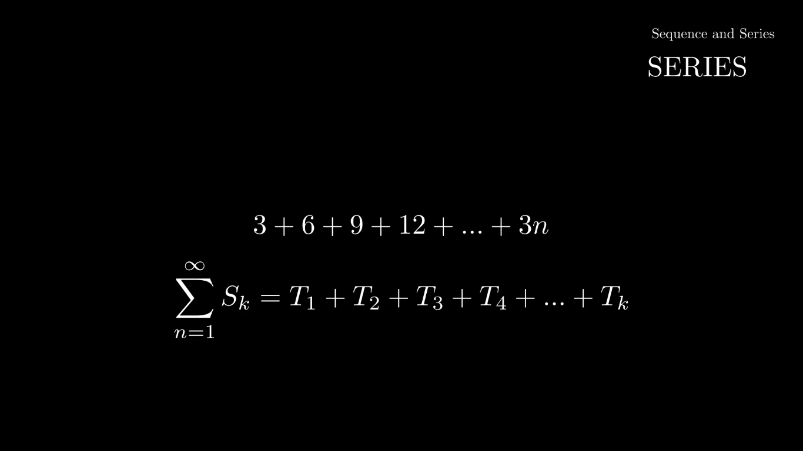

# WELCOME

In this project, I use Python's [manim](https://github.com/3b1b/manim) package to create videos that will help Grade 12 Science students to learn through visuals like in the famous YouTube channel of the author of the _manim_ package [3Blue1Brown](https://www.youtube.com/@3blue1brown).
This project intents to cover the _Curriculum and Assessment Policy Statemen(CAPS)_ curriculum of South Africa. Enough research has been done to show that when learners/kids learn abstract STEM consepts through visualisations, they tend to understand the content better. 

## PROJECT GOALS
There are a number of goals I wish to achieve with this initiative, most are based from my experience as a learner/student and when I used to help peers and those younger understand abstract Math or Physics concepts. The initiative hopes to achieve :
- to convince learners that Science(especially Mathematics) isn't scary/ugly, but doable & beautiful.
- Provide motivation(real-world applications of the topic/subject discussed).
- Treat ALL learners as beginners to support those with poor performance(including Level 1), providing indepth explainations in Layman's(easy).
- Incorporate advanced university topics(in Layman's & for interest's sake) to help disadvantaged learners choose quantitative fields in higher education.
- and lastly, hoping to teach learners how to be curious and independent in fosturing their own ideas.

## STRUCTURE
Since I am the only one working on the project(_I'd appreciate and LOVE collaboration_), I will initially work on completing Mathematics lessons then later do Physical Sciences. If you wish to collab and do a different subject, you're more than welcome too. I intend to cover the following topics :
- Introduction to Set Theory( I believe it is important, so even non-math people can start understanding math)
- Probability
- Functions
- Sequences & Series
- Financial Mathematics(Finance)
- Calculus(Differential Calculus)
- Statistics
- Trigonometry
- Geometry(Analytical & Euclidean)

The videos will have a voice-over and will be made free to the public. See a demo below.

#### Wish me luck! Fingers crossed

